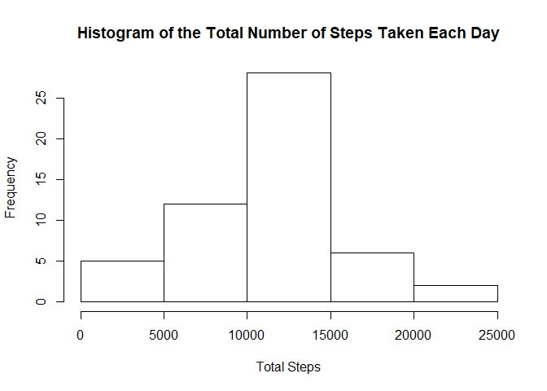
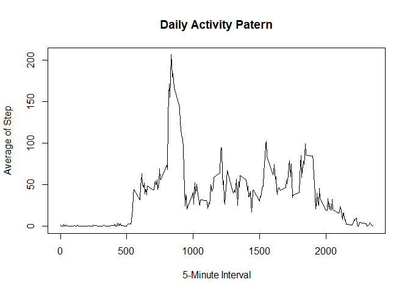
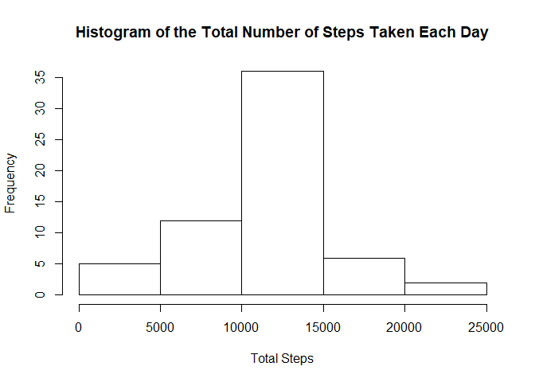
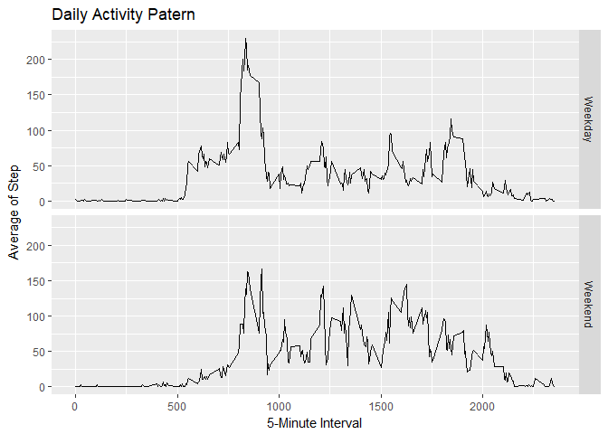

## Loading and preprocessing the data
Data being used in this report is from a personal activity monitoring device that will collects data for each 5 minute interval througout the day. The data has two months of data that was collected from an anonymous on October and November, 2012.  
  
Following is the code to load and preprocess the data : 
  

```r
#Load the data from CSV file
activity <- read.csv(file = "activity.csv", header = TRUE, na.strings = NA)

#Transform date from factor into date datatype. Cast the dataframe into tibble
#to be processed later using dplyr library
activity$date <- ymd(activity$date)
activity <- as_tibble(activity)
```
  
  
## What is mean total number of steps taken per day?
Before calculating the mean of total number of steps taken per day, we need to group and summarise the steps by date.  


```r
#Group and sum the step taken by date
activity_bydate <- activity %>% select(date, steps) %>% group_by(date)
activity_bydate_sum <- summarise_all(activity_bydate, sum)
```

From the summary dataset, we will create histogram to check the frequency distribution of total steps taken each day.  


```r
#Create histogram
hist(activity_bydate_sum$steps, 
     main = "Histogram of the Total Number of Steps Taken Each Day", 
     xlab = "Total Steps")
```

<!-- -->

From histogram above, we can see that the data distribution is having bell-shaped pattern. The total steps taken each day between the range of 10,000 and 15,000 has the most frequency distribution.  

Now we will calculate the mean and median of the total number of steps taken per day :  


```r
mean(activity_bydate_sum$steps, na.rm = TRUE)
```

```
## [1] 10766.19
```

```r
median(activity_bydate_sum$steps, na.rm = TRUE)
```

```
## [1] 10765
```


## What is the average daily activity pattern?
  
First, we will group and average the steps by interval across all date.  


```r
#Group and average the step taken by interval across all date
activity_byinterval <- activity %>% 
                        select(interval, steps) %>% 
                        group_by(interval)

activity_byinterval_avg <- summarise_all(activity_byinterval, 
                                         mean, 
                                         na.rm = TRUE)
```

  
We will create a time series plot based on the average dataset that have been created before.  


```r
#Plot the average of the step taken by interval across all date
with(activity_byinterval_avg, 
     plot(interval, steps, 
          type = "l", 
          main = "Daily Activity Patern", 
          xlab = "5-Minute Interval", 
          ylab = "Average of Step"))
```

<!-- -->

  
We will calculate which interval that has the maximum number of steps :   


```r
#Calculate which interval that has the maximum number of steps
max_step <- max(activity_byinterval_avg$steps)
activity_byinterval_avg[activity_byinterval_avg$steps == max_step,]$interval
```

```
## [1] 835
```


## Imputing missing values

Total missing value from the data :  

```r
sum(is.na(activity$steps))
```

```
## [1] 2304
```
  
  
We will use the mean value of 5-minute interval as a strategy for filling in all of the missing values in the dataset. Here is the code to create a new dataset that is equal to the original dataset but with the missing data filled in :  


```r
activity_without_na <- inner_join(activity, activity_byinterval_avg, by="interval")

#Replace the missing value with the average value of the corresponding interval
activity_without_na[is.na(activity_without_na$steps.x), ] <- 
    activity_without_na[is.na(activity_without_na$steps.x), ] %>%
    mutate(steps.x = steps.y)

activity_without_na <- select(activity_without_na, 
                              steps = steps.x, date, interval)
```
  
  
Please find the histogram of the newly created dataset with the missing data filled in :  


```r
#Group and sum the step taken by date
activity_without_na_bydate <- 
    activity_without_na %>% select(date, steps) %>% group_by(date)

activity_without_na_bydate_sum <- 
    summarise_all(activity_without_na_bydate, sum)

#Create histogram
hist(activity_without_na_bydate_sum$steps, 
     main = "Histogram of the Total Number of Steps Taken Each Day", 
     xlab = "Total Steps")
```

<!-- -->
  
  
We also will calculate the mean and median of the new dataset :  

```r
mean(activity_without_na_bydate_sum$steps)
```

```
## [1] 10766.19
```

```r
median(activity_without_na_bydate_sum$steps)
```

```
## [1] 10766.19
```
  
After imputing the new value from the dataset, there is not much different from the data pattern. The only slight difference that can be noticed is the median of data set is now the same with the mean value.  


## Are there differences in activity patterns between weekdays and weekends?
First, the new column will be added to the new dataset to indicate whether  particular observation falls on weekday or weekend. Here is the code :  


```r
#Add weekday / weekend
activity_without_na <- 
    mutate(activity_without_na, 
           week = factor(
                    ifelse(weekdays(activity_without_na$date) %in% 
                        c("Saturday", "Sunday"), "Weekend", "Weekday")
                    ))
```

The new summary data set will be created to take account of the new weekday / weekend column.  


```r
#Group and average the step taken by interval & week across all date
activity_without_na_byintervalweek <- activity_without_na %>% 
    select(week, interval, steps) %>% 
    group_by(week,interval)

activity_without_na_byintervalweek_avg <- 
    summarise_all(activity_without_na_byintervalweek, mean)
```

Then we will plot the new summary data to observe the summary activity on weekdays and weekend.  


```r
#Plot the data
ggplot(activity_without_na_byintervalweek_avg, aes(x=interval, y=steps)) +
    labs(title = "Daily Activity Patern") +
    labs(x = "5-Minute Interval", y = "Average of Step") +
    geom_line() +
    facet_grid(week ~ .)
```

<!-- -->

From the line plot, we can see there is significant activity difference between weekday and weekend :  
1. Activity on weekeday is started early compared to activity on weekend.  
2. Weekend has more activities on interval 10.00 to 18.00.  
3. There is signigicant high activity on interval 08.00 t0 10.00 in weekday   compare to weekend.
